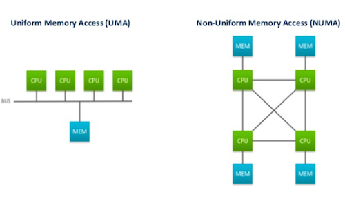

# OpenMP: An API for Writing Multithreaded Applications

* Parallel Application for Shared Memory
* Multi-threaded(MT) programs in Fortran, C/C++
* Standardizes last 20 years SMP practice

## Shared Memory
Any computer composed of multiple processing elements that share an address space. There are two classes:

1. Symmetric Multiprocessor (SMP): Assumes that OS treats each processor equally and a shared address space is in equal distance to each processor. Everything is plain. No processor or data unit is special. They are also called UMA.

2. Non-Uniform Address Space Multiprocessor (NUMA): Different memory regions have different access costs. Some memory segmented as "Near" or "Far" to a specific processor.



Of course, NUMA approach is more realistic due to cache hiearchy, but needs more programming effort.

## Environment
Include the OpenMP library if you want to use it.
```c
#include <omp.h>
```

To compile a code with omp structures:

``` 
gcc -o omp_helloc -fopenmp omp_hello.c
```

If you haven't specified the number of threads to be used:
`export OMP_NUM_THREADS=2`

Sample Code:
```c
#include <stdio.h>
#include <omp.h> 

int main() {
  #pragma omp parallel
  {
      int ID = omp_get_thread_num();
      printf("hello from processor: %d\n", ID);
  }
  return 0;
}
```

## Introduction

* OpenMP is a multi-threading, shared address model. This means that threads communicates by sharing variables.

But,

* Unintended sharing of variables causes race conditions: when the program's outcome changes as the threads are scheduled differently.
* To avoid race conditions -> use synchronization to protect data conflicts.
* Synchronization is expensive, therefore, change how data is accessed to minimize the need of synchronization.

## Creating Threads

* You can create threads with the parallel construct
```c
omp_set_num_threads(4);
#pragma omp parallel
{
 ...   
}
```

## Synchronization
Synchronization is used to impose order constraints and to protect access to shared data. This is in order to prevent __false sharing__.

### What is false sharing? 
The threads trying to use the same cache line at the same time, therefore, each update will cause the same cache line to "slosh back and forth" between the threads. 

If you promote scalars to an array to support creation of an SPMD program, the array elements are contagious in memory and hence share cache lines. This results to __poor scalability__.

* High level synchronization
    - critical
    - atomic
    - barrier
    - ordered
* Low level synchronization
    - flush
    - locks (both simple and nested)

### Synchronization: critical
Mutual exclusion: Only one thread at a time can enter __critical__ region.

```c
float res
#pragma omp parallel
{
    float B; int i, id, nthrds;
    id = omp_get_thread_num();
    nthrds = omp_get_num_threads();
    for(i=id; i<niters;i+nthrds){
        B = big_job(i);
    #pragma omp critical // threads wait their turn - only one at a time calls consume()
        consume(B, res); 
    }
}
```

Be sure that not a lot of things happening in the `critical` section because only a single thread can access the critical section at a time and therefore, the CPU time will be multiplied by the number of threads at this section due to serialized processing.

__Note:__ Do not put a `critical` section inside a loop! This will serialize whole loop.

### Synchronization: atomic
Atomic provides mutual exclusion but only applies to the update of a memory location (the update of X in the following example)
```c
#pragma omp parallel
{
    double tmp, B;
    B = do_it();
    tmp = big_ugly(B);
#pragma omp atomic
    X += tmp; //atomic only protects the read/update of X
}
```
In essence, `atomic` directive provides a mini-`critical` section. But, the statement inside the `atomic` section must be one of the following forms:

```c
x <binary_operation> = expr
x++;
++x;
x--;
--x;
```

### Synchronization: barrier

Each thread wait at the barrier until all threads arrive. When all threads arrive the barrier, they are allowed to go on.

```c
#pragma omp parallel
{
  int id = omp_get_thread_num();
  A[id] = big_cal1(id);

#pragma omp barrier //wait until all the A[id]'s calculated.
  B[id] = big_cal2(id,A);  
}
```

#### Explicit barriers/ skipping barriers with `nowait`

```c
#pragma omp parallel shared (A,B,C) private(id)
{
  id =omp_get_thread_num();
  A[id] = big_calc(id);
  #pragma omp barrier
  #pragma omp for
  for (i = 0; i < N; i++) {C[i] = big_calc3(i,A);} // implicit barrier ath the end of a for worksharing construct
  #pragma omp for nowait
  for(i = 0; i < N; i++) { B[i] = big_calc2(C,i);} // no implicit barrier due to nowait -> changes the default behavior
  A[id] = big_calc4(id);
} // again an implicit barrier at the end of a parallel region -> can't turn the barrier off at the end of a parallel region
```

## Parallel Loops (Worksharing)

A parallel construct by itself creates an SPMD or “Single Program Multiple Data” program i.e., each thread redundantly executes the same code. How do you split up pathways through the code between threads within a team? 
This is called __worksharing__.

Worksharing constructs:

* Loop construct
* Section construct
* Single construct
* Task construct

### Loop construct

Loop construct divides the work equally to the threads. Here is an example code for loop construct.

```c
#pragma omp parallel
{
  #pragma omp for
  for (int i=0; i<n; i++){
    NEAT_STUFF(I);
  }
}
```

For example, if you want to add two vectors with synchronization:

```c
#pragma omp parallel
{ 
  int id, i, Nthrds, istart, iend;
  Nthrds = omp_get_num_threads();
  id = omp_get_thread_num();
  printf("Num threads: %d\n", Nthrds );
  istart = id * numElements/Nthrds;
  iend = (id+1) * numElements/Nthrds;
  if (id == Nthrds - 1)
    iend = numElements;
  for (int i = istart; i < iend; i++){
    a[i] = a[i] + b[i];
  }
}
```

The same work can be done with parallel loop construct (worksharing):
```c
#pragma omp parallel
#pragma omp for
for (int i = 0; i < numElements; i++){
  a[i] = a[i] + b[i];
}
```

### Schedule Clause

Schedule constructs tell the compiler to split loops up between the threads in a way user specified. The usage of scheduling clause is as below:

```c
#pragma omp parallel for schedule(scheduling-type)
```

There several scheduling types to command compiler how loop iterations are mapped onto threads:

* `schedule(static, [chunk])`: Deal-out blocks of iterations of size __"chunk"__ to each thread. __Deciding at compile-time__ how it is going to break up the work between the threads. 
* `schedule(dynamic, [chunk])`: Take the loop iterations and put them into a logical task queue. Each thread grabs __"chunk"__ iterations off a queue until all iterations have been handled. __Deciding at run-time__ how it is going to break up the work between the threads. the chunk default is 1 iteration at a time. It is useful when the jobs that you want to distribute to the threads are not uniform in computational cost.
* `schedule(guided, [chunk])`: __(NOT USED OFTEN)__ Threads dynamically grab blocks of iterations. The size of the block starts large and shrinks down to size "chunk" as the calculation proceeds which is the most logical way of parallelization.
* `schedule(runtime)`: Schedule and chunk size will be given in the run-time. Schedule and chunk size taken from the OMP_SCHEDULE environment variable (or the runtime library). Use it when you are not sure which schedule is the best and you want to try whole bunch of them out. You can try different schedule in the runtime to test and see the performance.
* `schedule(auto)`: __(SOME OLD VERSION OMP DOES NOT SUPPORT auto)__ It trusts compiler to schedule automatically by giving the compiler the permission to be flexible in scheduling. 

When to use the schedule clause:

* __Static__: When amount of work between iterations is that I can work out in advance. 
  - Predetermined and predictable by the programmer. Least work at runtime: Scheduling done it compile time.
* __Dynamic__: If you don't know how long the iterations going to run.
  - Unpredictable, highly variable work per iteration. Most work at runtime: Complex scheduling logic used at runtime.

Ease of using loop constructs:

__VERBOSE:__

```c
double res[MAX]; int i;
#pragma omp parallel{
  #pragma omp for
  for (int i = 0; i < MAX; i++){
    res[i] = huge();
  }
}
```

__BETTER:__

```c
double res[MAX]; int i;
#pragma omp parallel for
for (int i = 0; i < MAX; i++){
  res[i] = huge();
}
```

If you opened a `schedule(runtime)` clause to define the scheduling the run time, you can get the current schedule with `omp_get_schedule()` and set the schedule with `omp_set_schedule()`.

To understand the chunk size for the scheduling please refer to [here](http://jakascorner.com/blog/2016/06/omp-for-scheduling.html){:target="_blank"}.

### Working with Loops

* Find the compute-intensive loops
* Make the loop iterations independent so they can safely execute in any order without loop-carried dependencies
* Place appropriate OpenMP directive and test

(OpenMP makes the loop control index on a parallel loop private to a thread)

For example, iterator `j` has loop-carried dependence:

```c
int i, j, A[MAX];
j = 5;
for (int i = 0; i < MAX; i++)
{
  j += 2;
  A[i] = bigOperation(j);
}
```

Find a way to represent `j` in terms of `i` and parallelize the loop:

```c
int i, j, A[MAX];
#pragma omp parallel for
for (int i = 0; i < MAX; i++)
{
  int j = 5 + 2 * (i+1);
  A[i] = bigOperation(j);
}
```

## Reduction

It tells compiler to create a (local) copy of the variable in the list that is local to each thread. 

`reduction(op:list)` 

* It first initialize the local copy of each thread. Initialization of the variables in the list depends on the operation type. It tries to initialize the variable with the identity element for the operation. 

For arithmetic operators,

| Arithmetic Operator | Initial Value |
|---------------------|---------------|
| + | 0 |
| * | 1 |
| `min` | Largest number |
| `max` | Most negative number |

For logical operators,

| Logical Operator | Initial Value |
|----------|---------------|
| and(&) | ~0 |
| or | 0 |
| ^ | 0 |
| and | 1 |
| or | 0 |

* Updates occur in the local copy during the operation.
* After all the operations in the parallel regions done, local copies are reduced into a single value and combined with the original value.

Look at the example. Here, this code is impossible to update because the nth operation is dependent on the n-1 steps:

```c
double ave = 0.0; A[MAX]; int i;
for (int i = 0; i < MAX; i++){
  ave += A[i];
}
ave = ave/MAX;
```

```c
double ave = 0.0; A[MAX]; int i;
#pragma omp parallel for reduction(+:ave)
for (int i = 0; i < MAX; i++){
  ave += A[i];
}
ave = ave/MAX;
```

## Advanced barriers

### Master construct 

The `master` construct denotes a structured block that is only exectuted by the master thread. The other threads just skip this section (no synchronization is implied).

```c
#pragma omp parallel
{
  do_many_things();
  #pragma omp master
  { exchange_boundaries(); }
  #pragma omp barrier // telling other threads to wait until systematic changes
  do_many_other_things(); 
}
```

__Note:__ There is no implicit barrier at the end of master construct.

### Single construct

The single construct denotes a block of code that is executed __by only on thread__ (not necessarily the master thread). 

__Note:__ A barrier implied at the end of the `single` block (You can remove the barrier with a `nowait` clause).

```c
#pragma omp parallel
{
  do_many_things();
  #pragma omp single
  { exchange_boundaries(); } // an implicit barrier is present
  do_many_other_things();
}
```

### Sections construct

The sections worksharing construct gives a different structured block to each thread.

```c
#pragma omp parallel
{
  #pragma omp sections
  {
    #pragma omp section
    x_calculation(); // only one thread does this section
    #pragma omp section
    y_calculation();
    #pragma omp section
    z_calculation();
  } // by default there is barrier at the end of the omp sections
}
```

__Note:__ By default, there is barrier at the end of the omp sections. You can use `nowait` clause to turn off the implicit barrier.

### Lock constructs

Locks are the lowest level of mutual exclusion synchronization in concurrent programming. It is used for greater control over how you do the synchronization. Basically, if you hold the lock, the thread can do whatever you like. If you want to grab a luck that someone else is holding, you must wait until they are done. It is used in general to block the access of other threads to specific portion of the memory.

__Lock routines:__

* `omp_init_lock()` : initializes the lock variable,
* `omp_set_lock()` : it is called when you want to grab a lock,
* `omp_unset_lock()` : when you are done with this lock, you can leave the lock with it. 
* `omp_destroy_lock()` : free up the space of the lock.
* `omp_test_lock()` : it checks if a certain lock is available or not and if it is available it returns the lock.

__Lock example:__ Design a histogram and put lock to each bin of the histogram

```c
#pragma omp parallel for
for (i = 0; i < NBUCKETS; i++)
{
  omp_init_lock(&hist_locks[i]); // one lock per element of hist
  hist[i] = 0;
}
#pragma omp parallel for
for(i = 0; i < NVALS; i++){
  ival = (int) sample(arr[i]); // find which this value belongs to
  omp_set_lock(&hist_locks[ival]); // enforce mutual exclusion on update 
  hist[ival]++;
  omp_unset_lock(&hist_locks[ival]); // release the lock on this region
}

for(i = 0; i < NBUCKETS; i++)
  omp_destroy_lock(&hist_locks[i]); // free-up the storage after it is done.
```

## Runtime Library Routines

In general, you tell the compiler to do the things for you when you write `#pragma`. However, you might need some information about the parallelization in run-time.

* Modify/Check the number of threads:
  - `omp_set_num_threads()` : set the number of threads,
  - `omp_get_num_threads()` : get the number of threads avaiable,
  - `omp_get_thread_num()` : get the thread ID, 
  - `omp_get_max_threads()` : maximum threads available to be set.
* Are we in an active parallel region?
  - `omp_in_parallel()`
* Do you want the system to dynamically vary the number of threads from one parallel construct to another?
  - `omp_set_dynamic()` : set the dynamic mode or give me the dynamic mode
  - `omp_get_dynamic()` : am I in dynamic mode or not?
* How many processors in the system?
  - `omp_num_procs()` : to learn what type of system that your code is running on. 

__Example code:__ Imagine that I really care the amount of threads in this program because my algorithm needs to be sure it is running on specific amount of threads, e.g. only single thread per processor.

```c
#include <omp.h>
void main()
{
  int num_threads; 
  omp_set_dynamic( 0 ); // disable dynamic adjustment of the number of threads
  omp_set_num_threads( omp_num_procs() ); // request as many threads as you have processors
  #pragma omp parallel
  {
    int id = omp_get_thread_num(); // get the thread ID
    #pragma omp single
    { num_threads = omp_get_num_threads(); } // protect this op since Memory stores are not atomic
    do_lots_of_stuff(id);
  }
}
```

Note: Remember that OpenMP specifically gives an implementation on the flexibility to give you fewer threads than you asked for.

## Environment Variables

When you deliver the code to someone, they will not recompile but reuse it in their own system. But there are certain things we want them to play around with the execution of the program without compiling. That's where we use the environment variables. These variables can be set in shell script or in a batch file.

* `$ OMP_NUM_THREADS <int>` : How many threads the user is asking for.
* `$ OMP_STACKSIZE <int>` : To control the size of child threads' stack when you create the threads allocate extra stack size. This allows you to avoid running out of stack. (stackoverflow)
* `$ OMP_WAIT_POLICY` : to hint to runtime how to treat idle threads
  - `ACTIVE` : keep threads alive at barriers/locks -> allocates processors and burns some CPU cycles if the waits are long.
  - `PASSIVE` : try to release processor at barriers/locks -> if thread is waiting just release it for economy, but suspending and rewaking a thread is more expensive than keeping a thread for a short time.
* `$ OMP_PROC_BIND <true/false>` : Process binding is enabled or disabled. The process binding means if you bind a thread to a processor leave it there. Don't change the thread from one processor to another.
  - true : it creates threads and binds them to the core. If you have code which does a lot of work to pre-stage data in the caches, then it is beneficial to use process binding. 
  - false :  if the core you are using is busy, the thread is migrated to another less busy core. 

## Data Environment

Normally, each thread can see all the data in the heap so they are shared between the threads. The shared variables and the variables in the stack which are local to threads are the concept we take in the data environment. We will see how to make them shared or private to the thread in this section.

* OpenMP is a shared memory programming model. Most variables are shared by default.
* Global variables are SHARED among threads.
  - File scope variables
  - static variables
* But not everything is shared:
  - Stack variables in functions called from parallel regions are PRIVATE.
  - Automatic variables within a statement block are PRIVATE.

In short, heap is shared and stack is private.  


